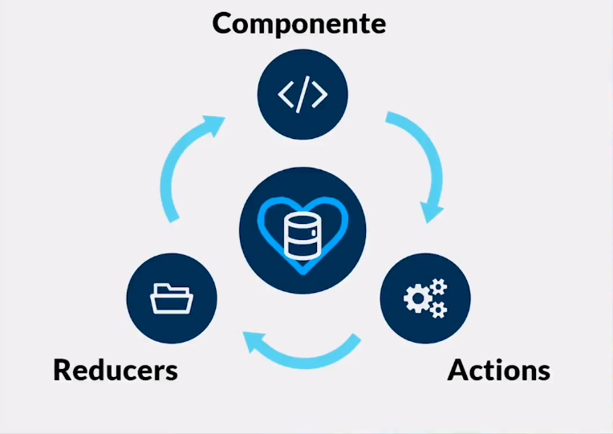
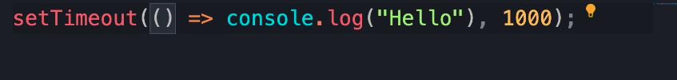
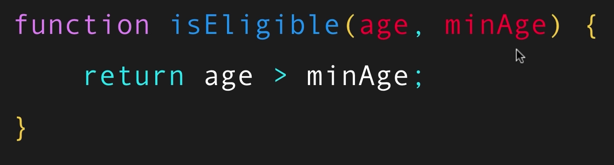
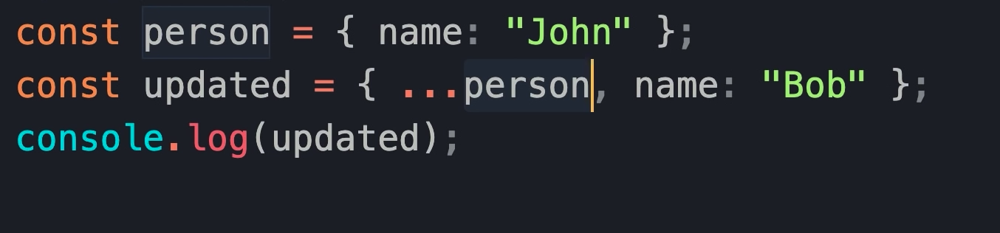

# nuevo proyecto con template react+redux

npx create-react-app my-app --template redux

### mi motivacion para usarlo

podemos elegir a que componentes entregar un estado que almacena redux.  
tambien ayuda a administrarnos cuando sean muchos componentes.

#Bases de REDUX

- basicos
  - store (almacenamiento)
  - reducer (estados para entregar o almacenar)
  - action creators (funciones para pedir informaciones)
  - componentes (codigo jsx o componentes de interfaz)

# el ciclo de vida en Redux

# Conceptos basicos antes de Redux

- ## First class functions

sea una funcion a la que se le pasa por parametro otra funcion a ejecutar o que la funcion principal ya contenga funciones dentro sea anonimas u otra todas corresponden a una first class function ya que principalmente Esta funcion ejecuta otra dentro y esta es la que regresa algo.

- ## function composition

como es descrito por su nombre es una composicion , personalmente me recuerda a la forma en que estructuramos o usamos componentes ya sea en React u otro.

**Loadash es un paquete NPM que permite hacer esto de forma mas secnilla**

- ## currying

Currying es una tecnica u otra forma de crear una funcion clasica en javascript , pero esta consiste en no tomar todos los argumentos a la vez.

- ## higher order funcitons

una funcion que basicamente recibe otra funcion como argumento o tambien una funcion que regresa otra funcion como salida

esta definicion es algo ambigua pero esto realmente es muy usado en javascript.

- ## Pure Functions

es la funcion donde sus inputs seran predecibles por lo que usar random, dates no es compatible y sus parametros no mutan.

javascript no es un lenguaje dinamico ,mutable que se adapta a nosotros por lo que aplicar Pure function implica cambiar la forma en queusamos el lenguaje tipo y ahora podriamos escribir codigo predecible y rapido de revisar hablando de comparaciones de varaibles ya que comparariamos por ejemplo no tendriamos que comparar sus tipos de datos pero si su valor lo que ahorra 1 paso almenos de forma superficial.

- actualizar un objeto sin mutar sus datos **DEEPCOPY**

- **deep copy en un primer nivel**
  

- **deep copy a un nivel mas profundo**
  

- **LIBRERIA para inmutabilidad**
  **el deepcopy es posible como vemos pero produce codigo verboso y si es necesario hacerlo asi ya que en en este caso person y updated comparten la misma referencia algo el contenido en memoria y se ven alterados todos si no se usa este tipo de copy**

  **pero las librerias pueden evitar realizar este codigo verboso**
  

## aprender mas de redux

