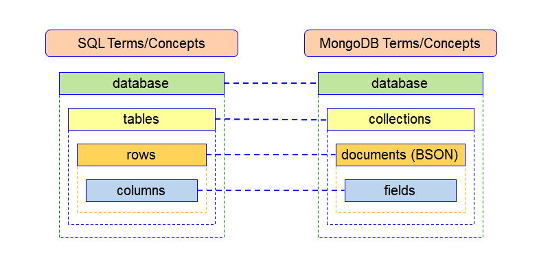

# SQL-no-SQL

<pre>
Que son las bases de datos?
Conjunto de datos almacenados para algun software.
</pre>

<pre>
ventajas de Bases de datos?
- pensados para su gestion y optimizacion de estos 
- grandes volumenes 
- facil acceso 
- multi uso por diversos usuarios
- roles y permisos
</pre>

<pre>
Etapas de su creacion
- Disenio de base de datos
- creacion
</pre>

<pre>
Tipos de base de datos
SQL   (consistencia y precisas al desarrollo)
NOsql (para sistema distribuido y con estructura de datos variable)
</pre>

<pre>
Sitemas de gestion  par las bases de datos?
se puede hacer con programas/sistemas de gestion o por CLI/consola
</pre>

<pre>
niveles de Modelado en bases de datos (los mas comunes)
- conceptual(sin aspecto tecnico y sera una representacion general)
- logico(estructuras de datos, tipos de datos)
- fisico(que se guardara? como se guardara? )
</pre>

# base de datos SQL y No Only SQL

# SQL

## conceptos para un buen Disenio

- la tabla tendra muchas filas
  - cada fila podria tener
    - primary key (identificador del dato)
    - foreign key (referencia a otro dato)
- relaciones entre tablas
  - 1:1
  - 1:N
  - N:M
- ventajas
  - no duplicidad
  - buena normalizacio de datos
  - integridad referencial al eliminar algun registro
- desventajas
  - deficiencia con [graficas,multimedia,sistema geograficos]

## Definiendo Objetivos

- cual es el objetivo de la BD?
- que acciones debe realizar la BD?
- cantida de usuarios promedio?

## Analisis de informacion

- analisar si existen algun medio de registro previo y aplicarlo los objetivos nuevos
- obtener las entidades

## Disenio Conceptual (facil de entender)

- diagramar/plasmar las entidades

## Moldeo logico (detallado)

- entidades (atributos,tipo dato , relaciones)

## Disenio fisico (el esquema)

- indices
- restricciones

# NO SQL

## conceptos para un buen Disenio

- orientado a la escabilidad
- se definen como NODOS conectados a una red mas grande.
- pensado para cintos de miles de datos
- no tienen algun tipo de schema fijo
- guardan CLAVE y VALOR

## Definiendo Objetivos

- cual es el objetivo de la BD?
- que acciones debe realizar la BD?
- cantida de usuarios promedio?

## Analisis de informacion

- analisar si existen algun medio de registro previo y aplicarlo los objetivos nuevos
- obtener las COLLECIONES de datos

## Disenio

- diagramar las colleciones
- realiza conexiones entre coleciones
- no abusar de embeber collections
