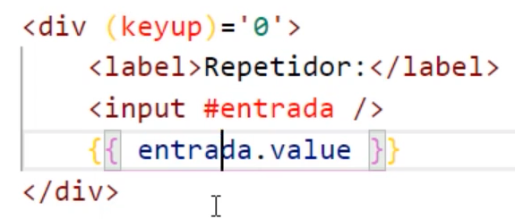
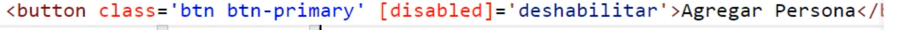
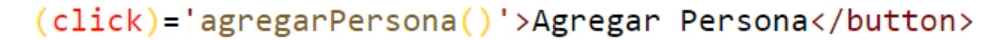
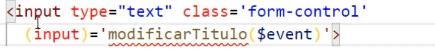
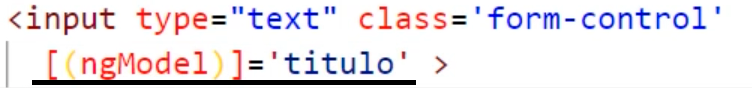

# instalacion del CLI angular

npm i -g @angular/cli  
o  
brew install angular-cli

## nuevo proyecto

ng new rickymorty-api

## funcion de angular

dentro de src existe [main.ts] este llama al un elemento en app [app.module.ts] que es donde se cargan nuestros futuros componentes.
[app.component.ts] es el primer componentes individual o embebido en la aplicacion que luego de ser creado ese llaman desde index.html a nivel de src

### comandos basicos

ng generate component [components/listado] !=
ng generate service [services/api] !=
ng serve -o // crea el server y muestra
yarn server -o // crea el server y muestra

### elementos del proyecto

@NgModule
@Component // decoracion, para crear componentes
@injectable

.. INPUT permite pasar dato entre componentes

- creacion del componente padre que se instancia como raiz
- creacion de componentes extras por ejemplo para mostrar un listado de datos
- agregar algun service para centralizar consumo de la fuente de datos

### conocimiento

- interpolacion {{texto dinamico}} 
  

- property binding (bind entre algun valor en su ts y html) 'desabilitar'= true o false
   

- event binding (para escuchar un boton o para leer datos de un input)
   
   

- two way binding para enviar datos de la clase al componente o componente a la clase
    - necesita importar un modulo 'FormModule'
   

