# DEBUGEANDO HTML Y CSS

inspeccionar navegador:

# cosas utiles del UI

- ctrl +shift + p (buscar comandos)  
-   (para seleccionar elementos del dom)  
- 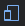 (para ver modo mobile)    
- 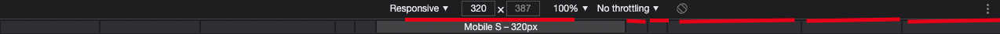 (para ver mas tama;os de tipo mobile)     

# secciones importantes del UI

- settings: simbolos de 
- Elements: muestra el dom que existe en ejecucion (no html)
  - command + f  (buscar en la pantalla seleccionada)   
  - doble click en elemento para editarlo
  - arrastrar elementos del dom para reorganizarlo :O!
  - Styles: muestra el estilo del un ELEMENTO seleccionador
  - Styles files: clickeando en su archivo.css vemos el de origen
  - Styles: algun aparecen tachados porque otro mas lo sobreescribio
  - podemos ver mas props de los estados de los elemento : con 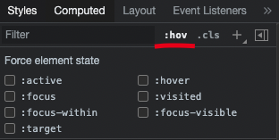  
  - agregando nuevos estilos desde el nav : 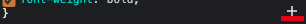
- Console: 

- Sources: los archivos de origen , html css js. (si edita hmtl real)
  - inspeccionando un elemento como css podemos formatearlo con : 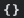
  - podemos editar codigo mientras lo vemos !!! : 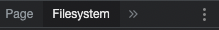
    - add folder workspace
    - editar algun archivo <3 magia
- Network: 
Performance:
Memory:
Application:
Security:
Audits:

# DOM y devtools

por ejemplo el contenido mostrado en ELEMENTS no es el mismo de SOURCE ya que el primero muestra lo computado y el otro muestra lo que realmente existe en el archivos de ORIGEN!

# aprendido
ver y editar archivos directamente en elnavegador 
majenar el DOM con el mouse
buscar cosas dentro del DOM
DOM != HTML source
seccion de ELEMENTS podria no persistir los cambios en el source

# DEBUGEANDO JAVASCRIPT

# console alerts
console log,info.warn.error /. dir,table
console log assert(true || false , enviar un mensaje)
console log tracer(muestra el rastreo de este dato)
console log groupCollapsed-groupEnd (grupo clog)

# breakpoints

en las devtools existen el $0 y otros utiles para debug
breakpoints,logpoints,edit breakpoint validacion dato

  
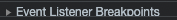  
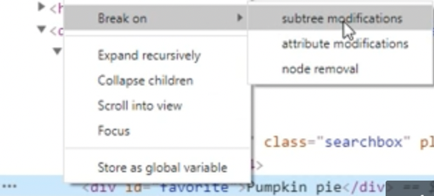

# snippets
- sources->snippets
- crea mi archivo snipet y agregar una funcion
  - console.log(window.location.href)
  - presiona ctrl+enter y se ejecuta el snippet selecionado

# workspace
podemos usar este mini IDE de navegador
para editar losa archivos desde source-> filesystem

# DEBUGEANDO NETWORK

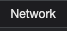

# ver mas opciones [metodo http y mas opciones]
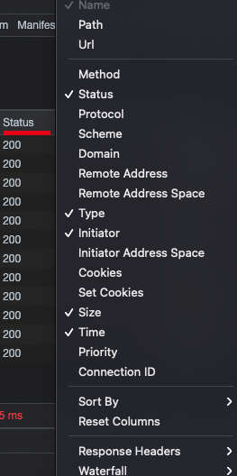

# filtrando lo que se muestra

All: TODO
XHR: objects are used to interact with servers
JS : JAVASCRIPT
CSS: CSS
IMG: IMAGES
FONT:FUENTES
DOC: documentos como el html mismo
OTHERS: favicon

# seleccionando un elemento filtrado
HEADERS = para ver datos http en general
PREVIEW = lo que se entrego
RESPONSE = cuerpo de la respuesta sin formatear
iNITIATOR = que parte de la aplicacion solitio el archivo,peticion,etc..
TIMING = tiempos en ms en que se procesa

# simulacion de internet 
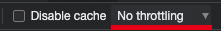

# graficos por secciones
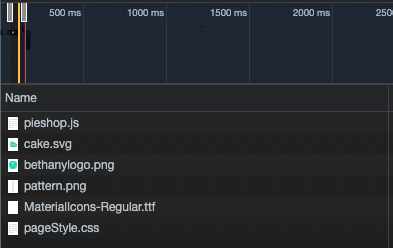

